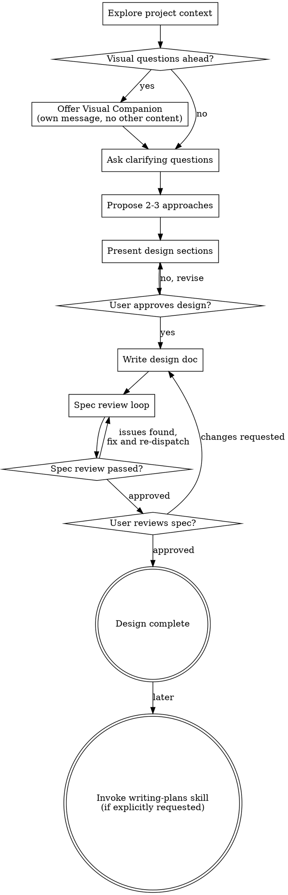

# Idea To Design Skill

Help turn rough web and app ideas into a structured design brief through natural collaborative dialogue.

Start by understanding the current project context, then ask questions one at a time to refine the idea. Once you understand what the user is building, present the design and get approval.

<HARD-GATE>
Do NOT invoke any implementation skill, write any code, scaffold any project, or take any implementation action until you have presented a design and the user has approved it. This applies even if the user says the product is simple.
</HARD-GATE>

## Scope Boundary

This skill is for frontend UI and interaction design only.

Focus on:

- pages and screens
- layout, hierarchy, and content visibility
- flows, actions, states, and feedback
- the visual system that supports the interface

Do not design:

- backend architecture, APIs, or databases
- domain or service boundaries
- internal automation logic
- component architecture or implementation code

If the user mixes UI design with system implementation, separate them and keep this skill on the UI side.

## Checklist

You MUST create a task for each of these items and complete them in order:

1. **Explore project context** — check files, docs, or any existing idea notes
2. **Offer visual companion** (if visual comparison would help) — this is its own message, not combined with a clarifying question. See the Visual Companion section below.
3. **Ask clarifying questions** — one at a time, focused on purpose, users, user-facing capabilities, pages, layout, states, interactions, and style
4. **Propose 2-3 approaches** — UI / interaction directions only, with trade-offs and your recommendation
5. **Present design** — in sections scaled to complexity, get user approval after each section
6. **Write design doc** — save the validated design brief
7. **Spec review loop** — re-check and tighten the written brief
8. **User reviews written spec** — ask the user to review the spec file before closing the design phase
9. **Optional handoff** — only if the user explicitly asks for implementation planning, invoke writing-plans afterward

## Process Flow



**The default terminal state is completed UI design.** Do NOT invoke implementation skills before the design is approved, and only invoke `writing-plans` if the user explicitly asks for implementation planning.

## Questioning Rules

Follow these rules tightly:

- Ask only one question per message
- Prefer the question that most reduces ambiguity about product goal, users, pages, layout, interaction, states, or style
- If the user gives a short answer, help with options
- If the user already answered something, do not ask it again
- If the user wants output immediately, write the best possible brief and mark assumptions clearly
- Do not ask technical implementation questions unless they directly affect visible UI behavior
- Do not ask about framework, backend, API shape, database, deployment, or orchestration
- If a technical topic appears, convert it into a UI question about what the user sees, does, or what state/feedback the interface must expose

## The Process

**Understanding the idea:**

- Check the current product context first if notes, specs, screenshots, existing pages, design references, or prior drafts exist, but only extract constraints that affect visible UI and interaction design
- Before asking detailed questions, assess scope: if the request contains too many independent ideas, reduce it to one product or one MVP slice first
- For appropriately-scoped projects, ask one question at a time to refine the idea
- Prefer multiple-choice questions when possible, but open-ended is fine when needed
- Focus first on purpose, target user, core scenario, and success criteria

**Clarifying product inputs:**

- Establish what the product is and what problem it solves
- Identify the target user or audience
- Clarify the main user journey the interface must support
- Confirm the must-have user-facing capabilities for the first version
- If needed, reduce the request to an MVP before expanding into pages
- Keep feature discussion at the interface level: what the user can do, see, filter, edit, confirm, compare, or recover from
- Do not drift into backend or internal system behavior unless it changes the UI

**Translating into interface design:**

- Turn the feature set into a complete page or screen list
- Make each page exist for a real user task, not because "apps usually have one"
- Explicitly enumerate all required pages before writing detailed page blueprints
- Include supporting pages when they are necessary to make the product usable: auth, onboarding, empty states, detail pages, settings, confirmation flows, and error-recovery pages
- For each key page, define goal, structure, modules, actions, key states, and interactions
- Recommend a layout direction using structural language, not vague adjectives
- Recommend a visual style that fits the product type and audience
- Extract or infer a design system direction from the user's answers: color palette, typography tone, spacing density, radius, elevation, and component behavior

**Exploring approaches:**

- Propose 2-3 different UI / UX directions with trade-offs
- Present the recommended option first with reasoning
- Trade off simplicity, clarity, interaction efficiency, information density, and visual personality
- Never turn this section into technical architecture options

**Presenting the design:**

- Once you understand what is being built, present the design
- Scale each section to complexity: short if simple, deeper if nuanced
- Ask after each section whether it looks right so far
- Cover at minimum: product concept, user-facing scope, page list, page layouts, user flows, interaction states, style direction, design system direction, and interaction notes
- Be ready to go back and clarify if something no longer fits

**Working in existing codebases or existing products:**

- If the user already has a product draft, redesign around what already exists instead of starting from zero
- Follow existing product constraints where relevant, but do not preserve weak structure if it blocks clarity
- Stay focused on design outcomes, not unrelated implementation refactors
- If technical details appear, translate them into visible UI implications instead of designing the underlying system

## After the Design

**Documentation:**

- Write the validated design brief to a markdown file
- Structure it so a designer, PM, or builder can act on it immediately
- If the user has a preferred path, use it; otherwise use a sensible project-local docs path

**Spec Review Loop:**
After writing the design brief:

1. Re-read it for clarity, coverage, and scope discipline
2. Fix vague sections, missing pages, or weak style guidance
3. Repeat until the brief is coherent and actionable

**User Review Gate:**
After the design brief is written, ask the user to review it before moving on:

> "Design brief written to `<path>`. Please review it and let me know if you want any changes before we close the design phase."

Wait for the user's response. If they request changes, make them and re-check the document. Only proceed once the user approves.

**Optional Handoff:**

- If the user explicitly asks for implementation planning, invoke the writing-plans skill afterward
- Do NOT skip from vague idea directly to implementation

## Output Standard

The final result should be a structured frontend UI and interaction design spec for a web or app product.

It should read like a polished product design spec focused on screens, flows, visible states, content hierarchy, and interaction behavior.

Core sections are fixed. Details inside the visual system, layout, page, component, and interaction sections should adapt to the project.

The page structure is not optional. The output must explicitly list every page or screen the product needs for the scoped version, not just the headline pages.

For the design-system portion, follow the spirit of `DESIGN.md`: a compact markdown expression of visual design intent that is human-readable, version-friendly, and easy to revise.

Do not turn the output or the conversation into a technical design document. Only mention technical dependencies when they create visible UI assumptions.

## Output Template

Always include these sections. Keep the structure stable, and keep the design-system content concise and product-specific.

```markdown
# [Product Name] UI Interaction Design Spec

## Overview

- What the product is
- What problem it solves
- What kind of platform it is
- What feeling the design should create

## Product Scope

- Primary users
- Core scenarios
- Must-have user-facing capabilities
- Scope boundaries or assumptions

## Information Architecture

- Exhaustive page or screen inventory for the scoped version
- Separate pages into core, supporting, and state-specific pages when useful
- Give each page a short purpose statement
- If a page is intentionally omitted, say why it is unnecessary

## Page Blueprints

Write one subsection for every required page listed in Information Architecture. Do not skip pages.

### [Page Name]

- Goal
- Layout structure
- Main modules
- Primary actions
- Key states
- Interaction notes
- Notes

## User Flows

- 2-4 important journeys through the product

## Visual Direction

- Brand mood
- Visual keywords
- Experience principles

## Design System Direction

- Summarize the visual system in a `DESIGN.md` style
- Include only the sections this product actually needs, typically from colors, typography, spacing, components, elevation, and guidelines
- For each included section, provide concrete values or usage guidance when the conversation supports it
- Do not force every possible token category if the product does not need it
- Prefer one coherent design-system block over scattered visual notes

## Interaction Notes

- Important UX behaviors
- Feedback states
- Empty / loading / error state ideas if relevant

## Do's and Don'ts

1. Do ...
2. Don't ...

## Open Questions Or Risks

- Items that still need confirmation
```

## Quality Bar

A strong output should:

- enumerate all required pages, not just "home page" and "details page"
- ensure every page in Information Architecture has a matching Page Blueprint
- describe page layout in structural terms
- tie user-facing capabilities to real user goals
- recommend a visual style that matches the product audience
- express the design-system portion as a compact markdown source of truth an AI agent can use directly
- infer a coherent design-system direction instead of only describing mood
- include concrete tokens or directional values where helpful
- define only the components and visual rules the product actually needs
- define key visible states and interaction behavior for important screens
- include interaction guidance for important actions
- call out assumptions instead of hiding uncertainty

A weak output:

- repeats the user's idea without adding structure
- lists features with incomplete page mapping
- mentions a few obvious pages but omits supporting flows needed to make the product usable
- drifts into backend logic or technical implementation design
- asks the user to make technical architecture decisions during the design conversation
- uses vague style labels without practical meaning
- outputs only a product summary instead of a usable spec
- creates a bloated design-system checklist with no relation to the actual product
- names colors or fonts without explaining their role
- proposes too many pages for a simple MVP

## Writing Guidance

When writing the final document:

- be decisive
- use crisp product and UX language
- keep sections skimmable
- prefer concrete structure over abstract theory
- derive the visual system from the user's answers; if details are missing, infer a cohesive default and mark it as an assumption
- treat the design-system portion like a `DESIGN.md` block: markdown-native, AI-readable, human-readable, and easy to revise in git
- do not expand the design-system portion into a giant template unless the user's problem actually needs that level of detail
- before finalizing, do a page coverage pass and ask: "Can the user complete every key flow with the pages listed here?"
- do not include implementation code, API design, database notes, service design, or backend tasks unless the user explicitly asks for a separate technical artifact
- if a technical unknown remains, express it only as a UI assumption or dependency, not as a design question to solve here

## Final Reminder

This skill keeps the original brainstorming discipline: explore, clarify, compare approaches, present the design, write the brief, get review, then hand off to planning.

The difference is the content focus: this version is specifically for turning web and app ideas into a frontend UI interaction spec with pages, layout, states, flows, style, and a compact `DESIGN.md`-style design-system section.

Do not get stuck in endless brainstorming. Ask what is necessary, then produce the brief.
